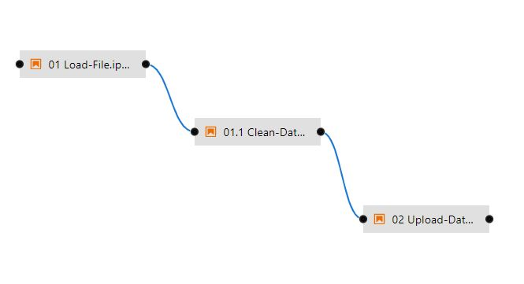

# Elyra Workflow Example

## Load JSON data into MySQL

#### JSON Format

Simple JSON row object format from the dataset. 

```json

{"overall": 4.0, "verified": true, "reviewTime": "03 11, 2014", "reviewerID": "A240ORQ2LF9LUI", "asin": "0077613252", "style": {"Format:": " Loose Leaf"}, "reviewerName": "Michelle W", "reviewText": "The materials arrived early and were in excellent condition.  However for the money spent they really should've come with a binder and not just loose leaf.", "summary": "Material Great", "unixReviewTime": 1394496000}
{"overall": 4.0, "verified": true, "reviewTime": "02 23, 2014", "reviewerID": "A1YCCU0YRLS0FE", "asin": "0077613252", "style": {"Format:": " Loose Leaf"}, "reviewerName": "Rosalind White Ames", "reviewText": "I am really enjoying this book with the worksheets that make you review your goals, what to do when you do not make it, it reminds me  of my human sexuality classwork.", "summary": "Health", "unixReviewTime": 1393113600}

```

#### Pipeline Solution


